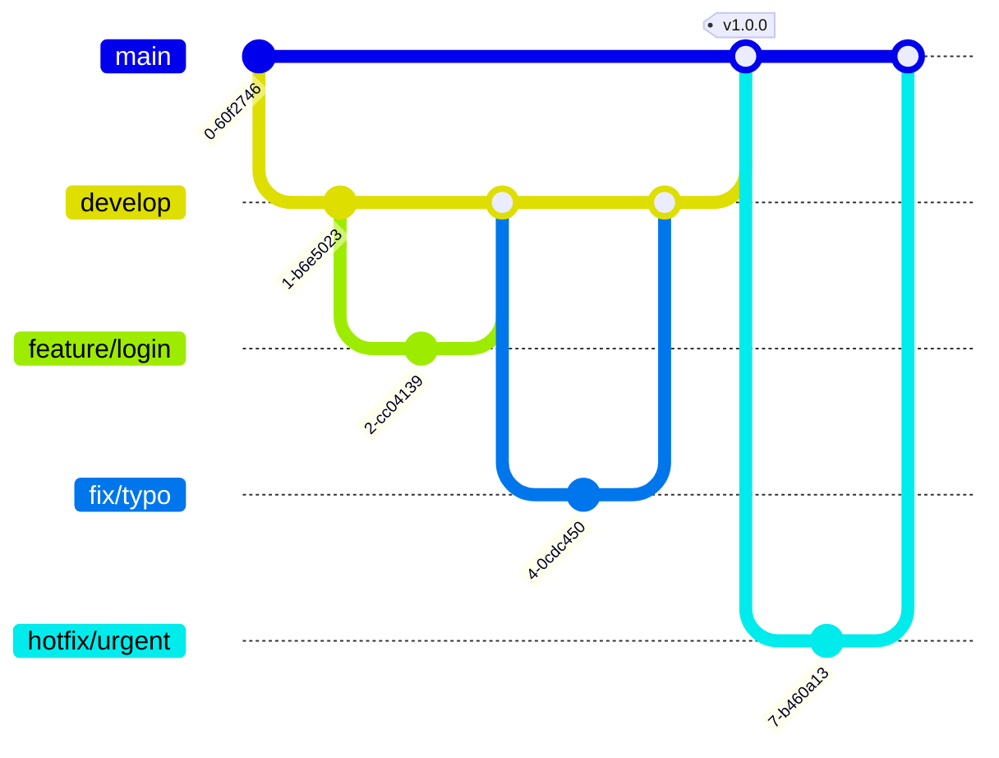

# 📘 Egobook Server

<div align="center">


<br><br>


<br>


<br>


</div>

<br>

## 📖 Project Overview

> **"모든 이들의 편안한 날을 위해"**

**Egobook**은 사용자의 감정을 담은 일기와 감정 데이터를 기반으로 **심리적 분석과 솔루션을 제공하는 어플리케이션**입니다.  
안정적인 트래픽 처리를 위해 **AWS VPC 기반의 서버 인프라**를 구축하였으며, **Docker & Redis**를 활용한 고성능 아키텍처를 지향합니다.

---

## 🏗 System Architecture

### 1. Server Infra Structure
Cloudflare를 통한 1차 보안 필터링 후, AWS VPC 내부에서 안전하게 요청을 처리합니다.

<div align="center">

</div>

<br>

| Layer | Component | Description |
| :--- | :--- | :--- |
| **Edge** | Cloudflare | DNS, CDN, WAF 적용 |
| **Public Subnet** | ALB, EC2 | Nginx Reverse Proxy + Spring Boot WAS |
| **Private Subnet** | AWS RDS | 외부 접근이 차단된 Data Layer |
| **Storage** | AWS S3 | IAM Role 및 CloudFront 기반 접근 제어 |

<br>

### 2. Project ERD
데이터 모델링 구조가 복잡하므로 아래 버튼을 눌러 확인해주세요.

<details>
<summary><b>🖼️ ERD 다이어그램 펼치기 (Click)</b></summary>
<br>
<div align="center">

</div>
</details>

<br>

### 3. Package Structure
기술 계층이 아닌 **도메인(Domain)** 중심으로 패키지를 구조화하여 응집도를 높였습니다.

```plaintext
com.egobook.server
 ├── global          # 전역 설정 (Config, Exception, Common Utils)
 └── domain          # 비즈니스 도메인 영역
      ├── user       # [Core] 사용자 도메인
      ├── diary      # 일기 및 감정 분석
      ├── letter     # 편지 및 소통
      ├── report     # 신고 및 제재 관리
      └── ...        # (Question, Item, Subscription etc.)
           ├── controller   # Presentation Layer (API 진입점)
           ├── service      # Business Layer (Transaction 관리)
           ├── repository   # Persistence Layer (JPA & QueryDSL)
           ├── entity       # Core Domain Entity
           ├── dto          # Data Transfer Object (Record 권장)
           └── mapper       # Entity ↔ DTO 변환
```

## 🛠 Tech Stack

| Category | Technology | Details |
| :--- | :--- | :--- |
| **Language** | Java | **JDK 21** (LTS) - Virtual Threads Ready |
| **Framework** | Spring Boot | **3.5.6** (Latest Stable) |
| **Build Tool** | Gradle | Groovy DSL |
| **Database** | MySQL | AWS RDS (Private Subnet) |
| **Cache** | Redis | Docker Containerized |
| **ORM** | Spring Data JPA | QueryDSL 포함 |
| **Docs** | SpringDoc | Swagger UI (OAS 3.0) |
| **Infra** | AWS | EC2, S3, ALB, VPC, IAM |

---

## 🔀 Git Strategy

### 1. Branching Strategy



### 2. Convention Rules
**🏷️ Branch Naming**
| **Prefix** | **설명** | **예시** |
| --- | --- | --- |
| **`main`** | 배포용 브랜치 | `main` |
| **`develop`** | 개발용 브랜치 (PR 도착지) | `develop` |
| **`feature/`** | 새로운 기능 개발 | `feature/login`, `feature/board-crud` |
| **`fix/`** | 버그 수정 (개발 중) | `fix/typo`, `fix/logic-error` |
| **`hotfix/`** | 긴급 수정 (배포 후) | `hotfix/server-down` |

**💬 Commit Message**
```
🎯 Git Convention
🎉 Start: Start New Project [:tada:]
✨ Feat: 새로운 기능을 추가 [:sparkles:]
🐛 Fix: 버그 수정 [:bug:]
🎨 Design: CSS 등 사용자 UI 디자인 변경 [:art:]
♻️ Refactor: 코드 리팩토링 [:recycle:]
🔧 Settings: Changing configuration files [:wrench:]
🗃️ Comment: 필요한 주석 추가 및 변경 [:card_file_box:]
➕ Dependency/Plugin: Add a dependency/plugin [:heavy_plus_sign:]
📝 Docs: 문서 수정 [:memo:]
🔀 Merge: Merge branches [:twisted_rightwards_arrows:]
🚀 Deploy: Deploying stuff [:rocket:]
🚚 Rename: 파일 혹은 폴더명을 수정하거나 옮기는 작업만인 경우 [:truck:]
🔥 Remove: 파일을 삭제하는 작업만 수행한 경우 [:fire:]
⏪️ Revert: 전 버전으로 롤백 [:rewind:]
```


