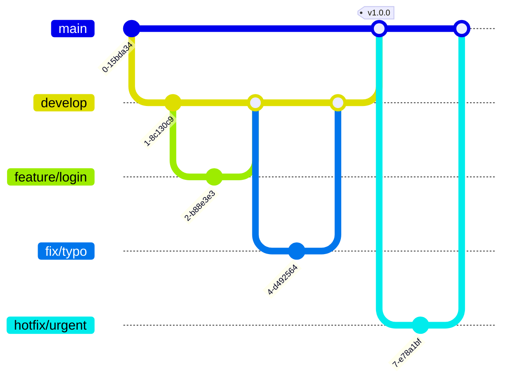

# Egobook Server

<div align="center">


<br><br>


<br>


<br>


</div>

<br>

## Project Overview
 **'에고북(EGOBOOK)'** 은 기존 디지털 멘탈케어 시장의 애플리케이션의 단점을 **"AI를 활용한 심리 케어"**, **"캐릭터와 성장해 나가는 게이미피케이션"**, **"익명으로 소통하는 커뮤니티 공간"** 의 3가지의 솔루션으로 해결하고자 하는 멘탈케어 애플리케이션입니다. 
 
 사용자는 순간적으로 느끼는 **감정을 세분화하여 일기로 기록**하며, 본인이 기록한 일기를 바탕으로 AI에게 심리적인 위로를 받습니다. 또한 AI는 사용자의 활동을 바탕으로 한 **객관적인 통계와 피드백을 제공**함으로써 스스로가 좋아지고 있다는 확신과 앞으로의 회복 방향성을 제시합니다. 사용자가 성장하는 만큼 캐릭터도 성장하도록 함으로써 **게이미피케이션을 통해 애플리케이션을 사용할 동기를 부여**하고, **"익명"** 이라는 요소를 이용하여 본인의 숨겨진 고민을 안전하게 나누고 타인과 공감하며 심리적 위안을 얻을 수 있도록 지원합니다.

---

## System Architecture

### 1. Server Infra Structure

<div align="center">

</div>


<br>

| Layer | Component | Description |
| :--- | :--- | :--- |
| **Edge** | Cloudflare | DNS, CDN, WAF |
| **Public Subnet** | ALB, EC2 | Nginx Reverse Proxy + Spring Boot WAS |
| **Private Subnet** | AWS RDS |  |
| **Storage** | AWS S3 | IAM Role 및 CloudFront 기반 접근 제어 |

<br>

### 2. Project ERD

<details>
<summary><b>🖼️ ERD 다이어그램 펼치기 (Click)</b></summary>
<br>
<div align="center">

</div>
</details>

<br>

### 3. Package Structure

```plaintext
com.egobook.server
 ├── global          # 전역 설정 (Config, Exception, Common Utils)
 └── domain          # 비즈니스 도메인 영역
      ├── user       # [Core] 사용자 도메인
      ├── diary      # 일기 및 감정 분석
      ├── letter     # 편지 및 소통
      ├── report     # 신고 및 제재 관리
      └── ...        # (Question, Item, Subscription etc.)
           ├── controller   # Presentation Layer (API 진입점)
           ├── service      # Business Layer (Transaction 관리)
           ├── repository   # Persistence Layer (JPA & QueryDSL)
           ├── entity       # Core Domain Entity
           ├── dto          # Data Transfer Object (Record 권장)
           └── mapper       # Entity ↔ DTO 변환
```

## Tech Stack

| Category | Technology | Details |
| :--- | :--- | :--- |
| **Language** | Java | **JDK 21** (LTS) - Virtual Threads Ready |
| **Framework** | Spring Boot | **3.5.6** (Latest Stable) |
| **Build Tool** | Gradle | Groovy DSL |
| **Database** | MySQL | AWS RDS (Private Subnet) |
| **Cache** | Redis | Docker Containerized |
| **ORM** | Spring Data JPA | QueryDSL 포함 |
| **Docs** | SpringDoc | Swagger UI (OAS 3.0) |
| **Infra** | AWS | EC2, S3, ALB, VPC, IAM |

---

## Git Strategy

### 1. Branching Strategy



### 2. Convention Rules
**Branch Naming**
| **Prefix** | **설명** | **예시** |
| --- | --- | --- |
| **`main`** | 배포용 브랜치 | `main` |
| **`develop`** | 개발용 브랜치 (PR 도착지) | `develop` |
| **`feature/`** | 새로운 기능 개발 | `feature/login`, `feature/board-crud` |
| **`fix/`** | 버그 수정 (개발 중) | `fix/typo`, `fix/logic-error` |
| **`hotfix/`** | 긴급 수정 (배포 후) | `hotfix/server-down` |

**💬 Commit Message**
```
🎯 Git Convention
🎉 Start: Start New Project [:tada:]
✨ Feat: 새로운 기능을 추가 [:sparkles:]
🐛 Fix: 버그 수정 [:bug:]
🎨 Design: CSS 등 사용자 UI 디자인 변경 [:art:]
♻️ Refactor: 코드 리팩토링 [:recycle:]
🔧 Settings: Changing configuration files [:wrench:]
🗃️ Comment: 필요한 주석 추가 및 변경 [:card_file_box:]
➕ Dependency/Plugin: Add a dependency/plugin [:heavy_plus_sign:]
📝 Docs: 문서 수정 [:memo:]
🔀 Merge: Merge branches [:twisted_rightwards_arrows:]
🚀 Deploy: Deploying stuff [:rocket:]
🚚 Rename: 파일 혹은 폴더명을 수정하거나 옮기는 작업만인 경우 [:truck:]
🔥 Remove: 파일을 삭제하는 작업만 수행한 경우 [:fire:]
⏪️ Revert: 전 버전으로 롤백 [:rewind:]
```

## Members
### 나형준 [팀장]
- **Email**: nahjjun123@gmail.com
- **Github**: [https://github.com/nahjjun](https://github.com/nahjjun)

### 김희원
- **Email**: rinakim1019@gmail.com
- **Github**: [https://github.com/heeone1](https://github.com/heeone1)

### 한다경
- **Email**: handakyeng@naver.com
- **Github**: [https://github.com/handagyeong ](https://github.com/handagyeong )

### 장지인
- **Email**: zin031219@naver.com
- **Github**: [https://github.com/7iniyo](https://github.com/7iniyo)

### 박효진
- **Email**: phjlia2430@gmail.com
- **Github**: https://github.com/phjlia2430

